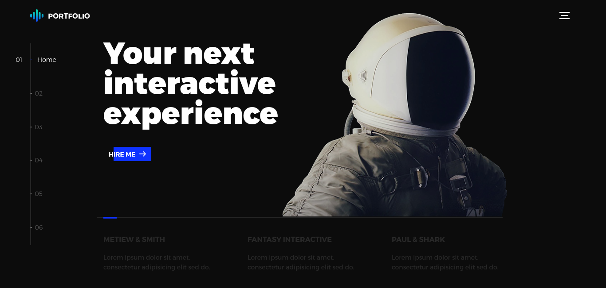
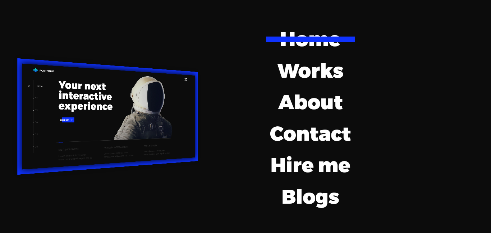

# Interactive 3D Navigation Portfolio

## Overview

This project is an interactive web application designed for my portfolio. It features a 3D navigation menu, an attractive dark theme, and a side navigation bar with timeline-based content. The project uses Hammer.js for touch gestures and jQuery for DOM manipulation and animations.





## Features

- **3D Navigation Menu**: A visually engaging 3D menu that enhances user interaction.
- **Dark Theme**: A modern, eye-friendly dark theme that is consistent throughout the application.
- **Side Navigation with Timeline**: A side navigation bar that displays content in a timeline format, providing a structured and intuitive user experience.
- **Touch Gesture Support**: Implemented using Hammer.js for smooth and responsive touch interactions.

## Technologies Used

- **HTML5**: The standard markup language for creating web pages.
- **Sass (CSS3)**: Preprocessor for CSS, used to style the application with an attractive dark theme.
- **JavaScript**: Adding interactivity and functionality.
- **jQuery**: Simplifying JavaScript coding for DOM manipulation and event handling.
- **Hammer.js**: Adding support for touch gestures.

## Performance Optimization

- **Minified Assets**: CSS and JS files are minified into single files to reduce load times.
- **Optimized Images**: Images are optimized for faster loading.

## Getting Started

### Prerequisites

No specific prerequisites are required beyond a modern web browser.

### Installation

1. Clone the repository:
    ```bash
    git clone https://github.com/SAMrat-543/Website-portfolio-demo.git
    ```
2. Open the project directory:
    ```bash
    cd Website-portfolio-demo
    ```

### Running the Project

Open `index.html` in your preferred web browser to view the application.

## Usage

- **Navigating the Menu**: Use the mouse or touch gestures to interact with the 3D navigation menu.
- **Viewing Content**: Use the side navigation bar to explore the timeline-based content.
- To be Continued

## Contributing

Contributions are welcome! Please follow these steps to contribute:

1. Fork the repository.
2. Create a new branch (`git checkout -b feature-branch`).
3. Make your changes.
4. Commit your changes (`git commit -m 'Add new feature'`).
5. Push to the branch (`git push origin feature-branch`).
6. Open a pull request.

## License

This project is licensed under the MIT License. See the [LICENSE](LICENSE) file for details.

## Acknowledgements

- [Hammer.js](https://hammerjs.github.io/)
- [jQuery](https://jquery.com/)
- [Sass](https://sass-lang.com/)

## Contact

If you have any questions or suggestions, feel free to reach out:

- GitHub: [SAmrat-543](https://github.com/SAmrat-543)
- Email: samrat@subedi-samrat.com.np

---

Thank you for checking out my project! I hope you find it useful and engaging.